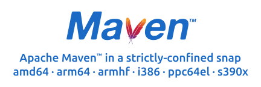

[Apache Maven](https://maven.apache.org) is a build automation tool used primarily for Java projects, with support for projects written in C#, Ruby, Scala, and other languages. This project builds [Snap packages](https://snapcraft.io/strictly-maven) of Maven directly from its [source repository](https://github.com/apache/maven) on GitHub. These packages are strictly confined, running in complete isolation with only limited access to your system. See the **Install** and **Usage** sections below for details.

## See also

This project is one of four that I created to gain control of my development environment:

* [OpenJDK](https://github.com/jgneff/openjdk) - Current JDK release and early-access builds

    [](https://snapcraft.io/openjdk)

* [OpenJFX](https://github.com/jgneff/openjfx) - Current JavaFX release and early-access builds

    [](https://snapcraft.io/openjfx)

* [Strictly Maven](https://github.com/jgneff/strictly-maven) - Apache Maven™ in a strictly-confined snap

    [](https://snapcraft.io/strictly-maven)

* [Strictly NetBeans](https://github.com/jgneff/strictly-netbeans) - Apache NetBeans® in a strictly-confined snap

    [](https://snapcraft.io/strictly-netbeans)

## Install

Install the Strictly Maven Snap package with the command:

```console
$ sudo snap install strictly-maven
```

The Snap package is [strictly confined](https://snapcraft.io/docs/snap-confinement) and adds only the following interfaces to its permissions:

* the [home interface](https://snapcraft.io/docs/home-interface) to read and write files under your home directory, and
* the [network interface](https://snapcraft.io/docs/network-interface) to download artifacts from remote repositories such as Maven Central.

If you also install the [OpenJDK Snap package](https://snapcraft.io/openjdk), the Strictly Maven Snap package will connect to it automatically for its Java Development Kit (JDK). You can install the OpenJDK Snap package with the command:

```console
$ sudo snap install openjdk
```

After both packages are installed, you'll see the following interface among their list of connections:

```console
$ snap connections strictly-maven
Interface             Plug                        Slot                 Notes
content[jdk-24-1804]  strictly-maven:jdk-24-1804  openjdk:jdk-24-1804  -
```

You can also connect them manually with the command:

```console
$ sudo snap connect strictly-maven:jdk-24-1804 openjdk:jdk-24-1804
```

You can use a different JDK by disconnecting the OpenJDK Snap package and setting the `JAVA_HOME` environment variable. Because the Strictly Maven Snap package is strictly confined, the JDK must be located under a non-hidden folder of your home directory. For example:

```console
$ sudo snap disconnect strictly-maven:jdk-24-1804
$ export JAVA_HOME=$HOME/opt/jdk-24
$ strictly-maven --version
```

## Trust

The steps in building the packages are open and transparent so that you can gain trust in the process that creates them instead of having to put all of your trust in their publisher.

Each step of the build process is documented below:

* [Build File](snap/snapcraft.yaml) - the Snapcraft build file that creates the package
* [Source Code](https://github.com/apache/maven/tags) - the release tags used to obtain the Maven source code
* [Snap Package](https://launchpad.net/~jgneff/+snap/strictly-maven) - information about the package and its latest builds on Launchpad
* [Store Listing](https://snapcraft.io/strictly-maven) - the listing for the package in the Snap Store

The [Launchpad build farm](https://launchpad.net/builders) runs each build in a transient container created from trusted images to ensure a clean and isolated build environment. Snap packages built on Launchpad include a manifest that lets you verify the build and identify its dependencies.

## Verify

Each Strictly Maven package provides a software bill of materials (SBOM) and a link to its build log. This information is contained in a file called `manifest.yaml` in the directory `/snap/strictly-maven/current/snap`. The `image-info` section of the manifest provides a link to the package's page on Launchpad with its build status, including the complete log file from the container that ran the build. You can use this information to verify that the Strictly Maven Snap package installed on your system was built from source on Launchpad using only the software in [Ubuntu 24.04 LTS](https://cloud-images.ubuntu.com/noble/current/).

For example, I'll demonstrate how I verify the Strictly Maven Snap package installed on my system at the time of this writing. The `snap info` command shows that I installed Strictly Maven version 3.9.9 with revision 24:

```console
$ snap info strictly-maven
...
channels:
  latest/stable:    3.9.9 2025-02-20 (23) 9MB -
  latest/candidate: 3.9.9 2025-03-15 (24) 9MB -
  latest/beta:      ↑
  latest/edge:      ↑
installed:          3.9.9            (24) 9MB -
```

The following command prints the build information from the manifest file:

```console
$ grep -A3 image-info /snap/strictly-maven/current/snap/manifest.yaml
image-info:
  build-request-id: lp-96593523
  build-request-timestamp: '2025-03-07T01:27:08Z'
  build_url: https://launchpad.net/~jgneff/+snap/strictly-maven/+build/2745349
```

The `build_url` in the manifest is a link to the [page on Launchpad](https://launchpad.net/~jgneff/+snap/strictly-maven/+build/2745349) with the package's **Build status** and **Store status**. The store status shows that Launchpad uploaded revision 24 to the Snap Store, which matches the revision installed on my system. The build status shows a link to the log file with the label [buildlog](https://launchpad.net/~jgneff/+snap/strictly-maven/+build/2745349/+files/buildlog_snap_ubuntu_noble_amd64_strictly-maven_BUILDING.txt.gz).

The end of the log file contains a line with the SHA512 checksum of the package just built:

```
Creating snap package...
Packed strictly-maven_3.9.9_all.snap
6d53fa4ad82bbbb5c6ef0e9760ca51abece44e7c063bd37f8cd383412e97f90bca00384d6f39a1724b3e14b00433993d146c40c884b8b68381257b147e7f4f1f  strictly-maven_3.9.9_all.snap
Revoking proxy token...
```

The command below prints the checksum of the package installed on my system:

```console
$ sudo sha512sum /var/lib/snapd/snaps/strictly-maven_24.snap
6d53fa4ad82bbbb5c6ef0e9760ca51abece44e7c063bd37f8cd383412e97f90bca00384d6f39a1724b3e14b00433993d146c40c884b8b68381257b147e7f4f1f  /var/lib/snapd/snaps/strictly-maven_24.snap
```

The two checksum strings are identical. Using this procedure, I verified that the Strictly Maven Snap package installed on my system and the Strictly Maven Snap package built and uploaded to the Snap Store by Launchpad are in fact the exact same package. For more information, see [Launchpad Bug #1979844](https://bugs.launchpad.net/launchpad/+bug/1979844), "Allow verifying that a snap recipe build corresponds to a store revision."

## Usage

You can put the following alias in your `~/.bash_aliases` file to be able to run the Strictly Maven Snap package using the normal Maven `mvn` command:

```bash
alias mvn='strictly-maven'
```

Verify that the Strictly Maven Snap package is working and connected to the OpenJDK Snap package with the following commands:

```console
$ type mvn
mvn is aliased to `strictly-maven'
$ mvn --version
WARNING: A restricted method in java.lang.System has been called
WARNING: java.lang.System::load has been called by org.fusesource.jansi.internal.JansiLoader in an unnamed module (file:/snap/strictly-maven/24/maven/lib/jansi-2.4.1.jar)
WARNING: Use --enable-native-access=ALL-UNNAMED to avoid a warning for callers in this module
WARNING: Restricted methods will be blocked in a future release unless native access is enabled

Apache Maven 3.9.9 (8e8579a9e76f7d015ee5ec7bfcdc97d260186937)
Maven home: /snap/strictly-maven/24/maven
Java version: 24, vendor: Snap Build, runtime: /snap/strictly-maven/24/jdk
Default locale: en_US, platform encoding: UTF-8
OS name: "linux", version: "6.8.0-55-generic", arch: "amd64", family: "unix"
```

Until a Maven update removes its use of a restricted method, you can avoid the warning message by creating the file `.mvn/jvm.config` in your project directory and adding the following option:

```console
$ cat .mvn/jvm.config
--enable-native-access=ALL-UNNAMED
```

You can also add the Java option to the environment variable `MAVEN_OPTS` as follows:

```console
$ export MAVEN_OPTS="--enable-native-access=ALL-UNNAMED"
$ mvn --version
Apache Maven 3.9.9 (8e8579a9e76f7d015ee5ec7bfcdc97d260186937)
Maven home: /snap/strictly-maven/24/maven
Java version: 24, vendor: Snap Build, runtime: /snap/strictly-maven/24/jdk
Default locale: en_US, platform encoding: UTF-8
OS name: "linux", version: "6.8.0-55-generic", arch: "amd64", family: "unix"
```

See the [Configuring Apache Maven](https://maven.apache.org/configure.html) page for more information about Maven environment variables and configuration files.

If you instead see the error message below, make sure that the OpenJDK Snap package is installed and connected as described earlier under the **Install** section:

```console
$ mvn --version
The JAVA_HOME environment variable is not defined correctly,
this environment variable is needed to run this program.
```

Then switch to a Maven project directory and try running the `mvn clean` command. If this is the first time running the command, you'll see Maven downloading the plugins required for the `clean` phase.

The Snap package does not have access to hidden files or folders in your home directory, so it uses the following alternative locations for the Maven user settings file and local repository directory:

| Apache Maven Default | Strictly Maven Alternative |
|----------------------|----------------------------|
| `~/.m2/settings.xml` | `~/snap/strictly-maven/common/settings.xml` |
| `~/.m2/repository`   | `~/snap/strictly-maven/common/repository`   |

The Snap package [runs Maven](bin/maven.sh) in its strictly-confined environment with a command equivalent to the following:

```bash
mvn --strict-checksums --settings ~/snap/strictly-maven/common/settings.xml "$@"
```

## Build

You can build the Snap package on Linux by installing [Snapcraft](https://snapcraft.io/snapcraft) on your development workstation. Run the following commands to install Snapcraft, clone this repository, and start building the package:

```console
$ sudo snap install snapcraft --classic
$ git clone https://github.com/jgneff/strictly-maven.git
$ cd strictly-maven
$ snapcraft
```

To run the build remotely on Launchpad, enter the command:

```console
$ snapcraft remote-build
```

See the [Snapcraft Overview](https://snapcraft.io/docs/snapcraft-overview) page for more information about building Snap packages.

## License

This project is licensed under the Apache License 2.0, the same license used by the Apache Maven project. See the [LICENSE](LICENSE) file for details. Apache Maven and the Maven logo are either registered trademarks or trademarks of the Apache Software Foundation in the United States and/or other countries.
